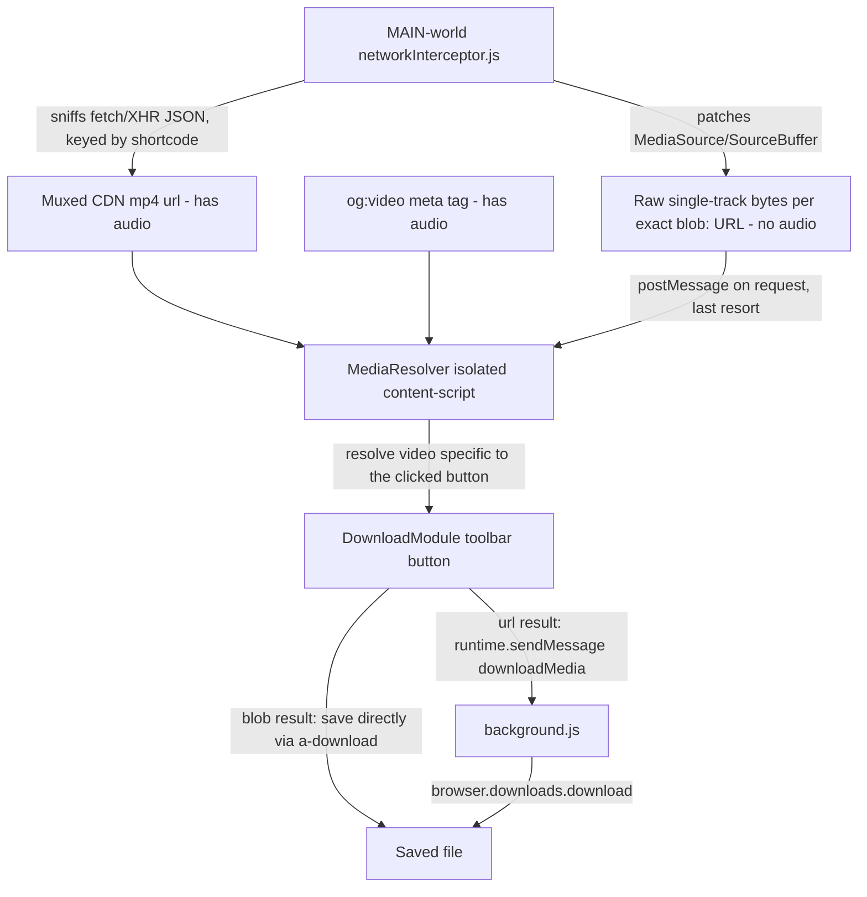

# Implementing a "Download" feature — step-by-step guide

This guide is written specifically for ReelSleek's existing architecture (Manifest V3,
per-feature module classes, the `.reelsleek-toolbar-container` UI, and the
`content/controls.html` template system). It's based on a review of how comparable
Instagram-downloader extensions solve the hard part of this problem: **Instagram reels
are served as `blob:` URLs backed by `MediaSource`, not plain `.mp4` links**, so you
can't just do `fetch(video.src)`.

## 1. What other extensions do (research summary)

| Project | Technique | Notes |
|---|---|---|
| [HOAIAN2/Instagram-Downloader](https://github.com/HOAIAN2/Instagram-Downloader) | Walks the React Fiber tree from the DOM node to read the post's props (`video_url`) | Powerful but brittle — breaks whenever IG changes internal prop names |
| [ehmorris/High-Resolution-Downloader-For-Instagram](https://github.com/ehmorris/High-Resolution-Downloader-For-Instagram) (issue #64) | Reads `video_url` out of `window.__additionalData` / `_sharedData`, or queries `?__a=1` | `__a=1` and `_sharedData` are mostly deprecated/removed by IG now |
| [flurrux/insta-loader](https://github.com/flurrux/insta-loader) | Right-click → "open reel in new page" which resolves to a `/p/` permalink; downloads audio and video **separately** because IG splits streams | Confirms reels are adaptive/segmented — a single blob fetch will not contain full audio+video |
| [ziwdon/InstagramDownloaderButton](https://github.com/ziwdon/InstagramDownloaderButton) | MV3-compatible, injects a button next to the bookmark icon; resolves current carousel slide | Closest in spirit to ReelSleek's per-toolbar-button pattern |
| Most modern IG downloaders (2023+) | **Intercept `fetch`/`XHR` responses** made by Instagram's own web app (GraphQL / `/api/v1/media/...`) from an injected **MAIN-world** script, extract `video_versions[].url`, cache it against the post's shortcode/media id | The most robust current approach, since it uses IG's own already-authenticated, already-CORS-safe network calls instead of trying to re-fetch a revoked blob |

**Conclusion:** don't try to re-fetch the `blob:` URL directly, and don't rely on "the
most recent video URL seen anywhere on the page" either — Instagram preloads several
reels/posts ahead of the one currently in view, so a page-wide cache keyed by
"whatever arrived last" will intermittently resolve to the *wrong* video once multiple
items have preloaded. The implementation below instead captures the raw bytes fed into
the **exact** blob URL of the specific `<video>` element the user clicked download on
(via `MediaSource`/`SourceBuffer` interception), which cannot be confused with an
adjacent, preloaded item. A CDN `.mp4` URL captured from JSON responses (keyed by post
shortcode) or the `og:video` meta tag are kept only as secondary fallbacks.

## 2. Chosen architecture for ReelSleek



This slots in as a new feature module, following the exact same pattern as
`Rotate`, `AudioControl`, `TheaterMode`, etc. (static `setup()/attach()/detach()/reset()/resetAll()`,
template pulled from `content/controls.html`, button injected into
`.reelsleek-toolbar-container`).

**Important correctness note:** resolution must be keyed to the *exact* `<video>`
element/blob URL the user clicked download on — never to "the most recent video URL
seen anywhere on the page." Instagram's Reels feed preloads several items ahead of the
one currently in view, so a page-wide "last seen" cache will intermittently resolve to
a different, already-preloaded video. See `content/networkInterceptor.js` and
`content/mediaResolver.js` for how this is avoided (`MediaSource`/`SourceBuffer`
capture keyed by the specific blob URL, with no page-wide fallback).

**Important audio note:** Instagram's adaptive MSE stream (what actually plays in the
`<video>` element) splits video and audio onto **separate `SourceBuffer`s**. Raw
`MediaSource` capture can therefore only ever recover *one* track — usually the
video-only one. The JSON-sniffed `video_url`/`video_versions[].url` (and `og:video`)
are, by contrast, a single *complete, pre-muxed* progressive MP4 (the same file IG
serves for embeds/sharing) that already includes audio. `MediaResolver.resolve()`
therefore tries those first and only falls back to the (possibly audio-less)
MediaSource capture when no shortcode/JSON match exists — e.g. on the home feed, where
there's no reliable per-item shortcode to key off of.

## 3. Step-by-step implementation

The steps below reference the actual, working implementation shipped in this repo —
read the linked files for the full code rather than re-deriving it, so this guide
can't drift out of sync with the real implementation.

### Step 1 — Add permissions

`downloads` requires a permanent permission. Added alongside the existing permissions
in `manifest.json`:

```json
"permissions": ["storage", "tabs", "downloads"],
```

### Step 2 — Capture the real video bytes (the hard part)

See `content/networkInterceptor.js`, a **MAIN-world** script (runs in the page's own
JS context, not the extension's isolated world) that:

1. Patches `URL.createObjectURL` to remember which blob URL belongs to which
   `MediaSource` instance.
2. Patches `MediaSource.prototype.addSourceBuffer` and
   `SourceBuffer.prototype.appendBuffer` to record the raw bytes appended to each
   `SourceBuffer`, linked back to its owning blob URL.
3. On request (via `postMessage`), merges the recorded chunks for a *specific* blob
   URL into one buffer (preferring the video-typed/largest `SourceBuffer` when a
   video and audio track were split), and transfers it back to the isolated content
   script as a zero-copy `ArrayBuffer` transfer.
4. Also does a lighter-weight `fetch`/`XMLHttpRequest` JSON-response sniff (looking
   for `video_url`/`video_versions` fields) as a secondary source, keyed by the
   post's shortcode — used only as a fallback when capture #1-3 finds nothing.

Registered to run in the page's `MAIN` world in `manifest.json` (Chrome 111+/Firefox
128+ support this declaratively — no manual `<script>` injection needed):

```json
"content_scripts": [
  {
    "matches": ["*://*.instagram.com/*"],
    "world": "MAIN",
    "run_at": "document_start",
    "js": ["content/networkInterceptor.js"]
  },
  {
    "matches": ["*://*.instagram.com/*"],
    "css": ["content/base.css"],
    "js": [
      "content/shared.js",
      "content/mediaResolver.js",
      "content/audioControl.js",
      "content/videoControl.js",
      "content/autoscroll.js",
      "content/theaterMode.js",
      "content/rotate.js",
      "content/ambientMode.js",
      "content/download.js",
      "content/messaging.js",
      "content/index.js"
    ]
  }
]
```

> If you need to support browsers without declarative `"world": "MAIN"` support, fall
> back to injecting a `<script src="...">` tag pointing at a
> `web_accessible_resources` file from your isolated content script instead.

### Step 3 — Build the isolated-world resolver (`MediaResolver`)

See `content/mediaResolver.js`. It exposes a single entry point,
`MediaResolver.resolve(video)`, which:

1. Checks (and briefly waits ~600ms for) the JSON-sniffed CDN URL cache, keyed by
   `MediaResolver.getShortcode(video)` (the public entry point, backed by the private
   `#getShortcodeForVideo(video)` DOM lookup with a `PageHandler.getShortcode()`
   fallback). This is a complete, pre-muxed progressive MP4 (audio included), and is
   the fastest path since it costs no extra network round trip — but Instagram's home
   feed API response frequently omits the full `video_url` for a given item entirely
   (lighter-weight preview data), so this cache is often simply empty there.
2. If we're actually on this exact post's permalink page (`PageHandler.getShortcode()`
   matches the resolved shortcode), reads the *live* `og:video` meta tag — free, and
   safe here since the URL itself confirms which post it describes.
3. Otherwise, **actively fetches this specific shortcode's own permalink page**
   (`#fetchOgVideoForShortcode`, tries `/reel/{shortcode}/` then `/p/{shortcode}/`)
   and reads `og:video` from *that* freshly-fetched document. This is what makes
   home-feed downloads reliably include audio: rather than passively hoping
   Instagram's own feed API already sent the full video data (unreliable — that's why
   audio only "worked" when a video happened to be opened as a reel or the page was
   refreshed, both of which trigger IG's own full-data fetch), we request it directly,
   by shortcode, ourselves. Being keyed by shortcode also means it can never resolve
   to a stale/unrelated post the way blindly reading the *live* page's meta tag could.
4. Falls back to requesting captured bytes for `video.currentSrc || video.src` from
   the MAIN-world script (Step 2). This is an exact match tied to the specific
   element clicked (immune to cross-contamination with other preloaded/adjacent
   videos), but may be missing audio, since it only ever captures one adaptive-stream
   track. Used only when no shortcode could be found at all.
5. Returns `null` if nothing matched — **deliberately no "last URL seen" fallback**,
   since that's what caused an earlier wrong-video bug this design fixes.

Earlier revisions of this feature trusted the *live* `og:video` tag unconditionally as
a fallback. That's unsafe: Instagram's SPA doesn't reliably clear that tag on
client-side navigation, so on the home feed it could hold a stale value from whatever
permalink was last viewed in that tab — silently downloading the wrong (but
audio-having) video instead of genuinely being an audio problem. Step 3's active,
shortcode-scoped fetch replaces that unsafe fallback.

`#getShortcodeForVideo(video)` handles the case that `PageHandler.getShortcode()`
can't: pages like the home feed, where several posts are visible/preloaded at once and
the URL never changes to reflect any single one of them. It looks for a permalink
anchor scoped tightly to that specific video (either a wrapping `<a>`, as used by Reels
tiles, or one found within the enclosing `<article>`/`[role="article"]` container for
regular feed posts) — never a page-wide search, to avoid resolving to a *different*
nearby post. One wrinkle: `handleHomePageVideo` (`content/index.js`) neutralizes a
Reels tile's `href` to `javascript:void(0)` to stop it from hijacking clicks, so it
stashes the original value in `dataset.reelsleekOriginalHref` first. Since an
`[href*="/reel/"]`-style selector alone would no longer match the anchor once its live
`href` has been overwritten, `#SHORTCODE_LINK_SELECTOR` also matches on the presence of
that stashed `data-reelsleek-original-href` attribute so the anchor can still be
*found*, before `#extractShortcodeFromHref` reads the stashed value off it.

`MediaResolver.getShortcode(video)` is also used by `Download.buildFilename(video)`,
so home-feed downloads get a meaningful filename instead of a generic timestamp.

It returns a tagged result — `{ type: "blob", blob }` for captured bytes, or
`{ type: "url", url }` for a CDN URL — so the caller can decide how to save it.

`PageHandler.getShortcode()` (added to `content/shared.js` alongside the existing
`getVideoType()`) parses `/reel/{shortcode}/`, `/reels/{shortcode}/`, `/p/{shortcode}/`,
or `/tv/{shortcode}/` out of `window.location.pathname`.

### Step 4 — Add the button UI to `content/controls.html`

See the `reelsleek-download-template` `<template>` block (inserted right after the
autoscroll template), which follows the same button/SVG/`data-state` styling
conventions as the other toolbar templates (`.reelsleek-rotate`,
`.reelsleek-autoscroll`) — including a native-toolbar-mode style block guarded by
`body:not(.reelsleek-custom-toolbar)`.

### Step 5 — Create the `Download` feature module (`content/download.js`)

Follows the exact same shape as `content/autoscroll.js` (`XModule` for per-video UI,
with lazy template-load retry in `attach()`, + static `X` orchestrator class with
`setup/attach/detach/reset/resetAll`). The click handler:

1. Guards against double-clicks while a download is already in flight (`data-state="loading"`).
2. Calls `MediaResolver.resolve(this.video)`.
3. If the result is `{ type: "blob" }`: saves it directly client-side via
   `Download.saveBlob()` — creates an object URL from the `Blob` and clicks a
   temporary `<a download>` link. No extra permission or background round-trip
   needed for this path.
4. If the result is `{ type: "url" }`: messages `background.js` to perform the
   download via `browser.downloads.download()` (required since `chrome.downloads` is
   not available to content scripts).
5. Reflects `loading`/`done`/`error` back onto the button via `data-state`.

### Step 6 — Wire it into the pipeline

- `content/index.js`: `await Download.setup();` and `MediaResolver.setup();` next to
  the other `setup()` calls, and `Download.attach(video);` inside `handleVideo`.
- `content/messaging.js`: `Download.detach(v)`/`Download.attach(v)` added to the
  `setToolbarMode` and `resetAll` cases, matching how `Rotate`/`AutoScroll` are handled.
- `manifest.json`: registers `content/mediaResolver.js` and `content/download.js`
  (see Step 2's snippet) and adds `downloads` to `permissions`.

### Step 7 — Handle the URL-fallback download in `background.js`

```js
async function downloadMedia(url, filename) {
  try {
    await browser.downloads.download({ url, filename, saveAs: false });
    return { ok: true };
  } catch (err) {
    console.error("[background] Failed to download media:", err);
    return { ok: false, error: err?.message ?? String(err) };
  }
}

browser.runtime.onMessage.addListener((msg) => {
  if (msg.type === "checkPermission") return hasPermission();
  if (msg.type === "downloadMedia") return downloadMedia(msg.url, msg.filename);
});
```

IG's CDN URLs (when this path is used) are signed and short-lived — always resolve at
click-time, never persist a cached URL across sessions.

### Step 8 — Handle carousels & photo posts (scope decision)

Instagram posts can be multi-slide carousels mixing photos and videos. Decide scope
up front:

- **MVP:** download only the currently visible/playing slide (what `ziwdon`'s
  extension does) — `DownloadModule` already operates per-`<video>`, so this is free.
- **Stretch goal:** detect carousel siblings (`div[role="button"][aria-label*="Next"]`)
  and offer "download all," bundling with a small library like `JSZip` if you want a
  single archive — several researched extensions (`HOAIAN2`, `fajarmf10`) do this, but
  it adds real complexity (pagination through slides, image extraction via
  `.src`/`srcset`, zip generation). Treat as a v2 feature.

### Step 9 — Testing checklist

Manually verify on each surface type ReelSleek already distinguishes via `PageHandler`:

- [ ] Reel permalink (`/reels/{shortcode}/`)
- [ ] Post permalink with a single video (`/p/{shortcode}/`)
- [ ] Post permalink with a carousel (video not the first slide)
- [ ] Home feed video (autoplaying, not yet clicked)
- [ ] Post opened in a modal from the feed
- [ ] Story video (`/stories/...`) — confirm resolver fallback still works or is
      intentionally excluded (stories expire, IG serves them differently)
- [ ] Toggling "custom" vs "native" toolbar mode still shows/hides the button correctly
- [ ] Rapid scroll through many reels doesn't leak the JSON cache
      (cap `MediaResolver.#jsonCache` size, e.g. an LRU of ~50 entries — already done)
- [ ] Rapid scroll through many reels doesn't leak captured MediaSource bytes in
      `networkInterceptor.js`'s `blobUrlToSourceBuffers` (capped at
      `MAX_TRACKED_BLOB_URLS` — already done; each entry can hold several MB, so this
      matters for long scrolling sessions)
- [ ] Downloaded files have audio on reel/post permalinks (JSON/live-`og:video` path)
- [ ] Downloaded files have audio on home-feed Reels tiles *without* first opening
      them as a reel or refreshing the page (exercises `#fetchOgVideoForShortcode`,
      not just the passive JSON cache)
- [ ] Downloaded filenames use the real shortcode (not a generic timestamp) on both
      permalink pages and the home feed

### Step 10 — Known limitations to document for users

- If a video's post has no discoverable shortcode at all (neither from the URL nor
  from a nearby permalink anchor — e.g. a feed post whose DOM doesn't match the
  `<article>`/anchor heuristics `#getShortcodeForVideo` looks for), resolution falls
  back to the raw `MediaSource` capture, which only ever contains one adaptive-stream
  track — usually video only, no audio. Note
  this as a known limitation (as `flurrux/insta-loader` does for a similar reason)
  rather than silently shipping a broken file. Properly merging separately-captured
  video and audio `SourceBuffer`s into one valid container isn't just concatenation —
  it requires real remuxing (e.g. via `ffmpeg.wasm`), which is a meaningful
  size/complexity tradeoff better suited to a v2 iteration.
- Instagram frequently changes its API/response shapes; keep `extractVideoUrls`
  defensive (walk the whole JSON tree rather than hard-coded paths) to reduce how
  often this breaks.
- `#fetchOgVideoForShortcode` adds a real network round trip (up to two sequential
  requests, `/reel/` then `/p/`) whenever the passive JSON cache misses — typically
  every home-feed download that hasn't already been opened as a reel. This is an
  acceptable UX tradeoff for an explicit, infrequent user action (the button shows a
  `loading` state throughout), but avoid calling it in a hot path or automatically.
- Downloading others' content may violate Instagram's Terms of Service or copyright
  law depending on use — consider adding a brief in-product notice, and make the
  feature opt-in/toggleable from the popup like other ReelSleek features.

## 4. Suggested follow-ups (not required for v1)

- Add a popup toggle (`Messenger`/`PopupController` already have the plumbing) to
  enable/disable the download button globally.
- Add keyboard shortcut via the existing `addKeybind` helper (e.g. `KeyD`) mirroring
  `Rotate`'s `KeyJ/KeyK/KeyH` bindings.
- Add a small toast/animation on the button itself (`data-state="done"` /
  `"error"`) using the CSS pattern already sketched in Step 4's template.
